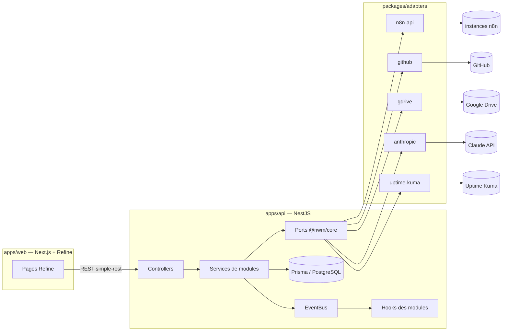

# ARCHITECTURE.md — StepForIt Ops

## 1. Vision

Une plateforme qui se connecte à **plusieurs instances n8n** (dev / preprod / prod) via leur API publique et apporte ce que n8n n'offre pas :

1. **Versioning** des workflows (DB locale + export GitHub / Google Drive)
2. **Vérification** structurelle et logique (refs de nœuds, expressions, revue IA)
3. **Vérification du JS** des nœuds Code
4. **Tests** de workflows (unitaires via copie bouchonnée, complets via webhook)
5. **Bascule d'environnement** des ressources externes (Airtable, Sheets, Notion, NocoDB…)
6. **Organisation** (naming, tags, dossiers) assistée par IA
7. **Documentation** : schéma Mermaid + résumé généré
8. **Arbre de dépendances** filtrable + analyse d'impact
9. **Optimisation** (naming des nœuds, nettoyage) avec renommage sûr
10. **Monitoring** (heartbeat + checks actifs) relayé vers Uptime Kuma

## 2. Architecture hexagonale

### Couches

| Couche | Localisation | Dépendances autorisées |
|---|---|---|
| **Domaine** | `packages/core/src/domain` | rien (TS pur) |
| **Ports** | `packages/core/src/ports` | domaine |
| **Événements** | `packages/core/src/events` | domaine |
| **Adapters** | `packages/adapters/*` | core + SDK/HTTP du système cible |
| **Application** | `apps/api/src/modules/*` | core, Prisma, EventBus, ports (via DI) |
| **Infra** | `apps/api/src/infra` | NestJS, Prisma, adapters (câblage DI) |
| **UI** | `apps/web` | API REST uniquement |

### Ports

| Port | Rôle | Adapter |
|---|---|---|
| `N8nApiPort` | workflows, tags, exécutions, webhooks d'une instance | `packages/adapters/n8n-api` |
| `VcsPort` | commit de fichiers (export versions) | `packages/adapters/github` |
| `StoragePort` | upload de fichiers (export versions) | `packages/adapters/gdrive` |
| `AiPort` | génération de texte / JSON structuré | `packages/adapters/anthropic` |
| `MonitorPort` | push up/down vers un monitor | `packages/adapters/uptime-kuma` |
| `MonitorAdminPort` | création/suppression de sondes (provisioning) | `packages/adapters/uptime-kuma` (Socket.io) |

Les adapters sont fournis à Nest par `infra/adapters/adapters.module.ts` via les tokens
`N8N_API_PORT`, `VCS_PORT`, `STORAGE_PORT`, `AI_PORT`, `MONITOR_PORT`. Remplacer un
système externe = écrire un nouvel adapter + changer une ligne de câblage.

## 3. Système de modules

### Chargement dynamique

`infra/modules-registry/modules.config.ts` liste `{ id → chemin d'import }`.
`modules.loader.ts` fait un `import()` de chaque chemin dans un try/catch :

- dossier supprimé → warning au boot, le reste fonctionne ;
- module présent → son `NestModule` est ajouté à `AppModule.register(...)`.

### Activation / désactivation à chaud

- Table `ModuleState` (`id`, `enabled`, `settings`).
- `ModuleRegistryService` : cache mémoire + `isEnabled(id)` + `setEnabled(id, bool)`
  (émet `module.enabled` / `module.disabled`).
- **Routes** : `@ModuleId('x')` sur le controller + `ModuleEnabledGuard` global → 404 si désactivé.
- **Hooks** : chaque handler `@OnEvent` commence par `if (!(await this.registry.isEnabled(ID))) return;`.

Un module désactivé ne répond plus et ne réagit plus aux événements ; le reste du
système continue (couplage uniquement par événements).

### Événements (catalogue)

| Événement | Émetteur | Consommateurs typiques |
|---|---|---|
| `workflow.synced` | workflows (core) | versioning, dep-graph |
| `version.created` | versioning | export GitHub/Drive (hook interne) |
| `verification.completed` | verifier | UI (findings) |
| `jscheck.completed` | js-checker | UI |
| `test.completed` | tester | UI |
| `env.switched` | env-switcher | versioning (re-snapshot) |
| `organizer.applied` | organizer | workflows (resync) |
| `doc.generated` | doc-schema | UI |
| `depgraph.rebuilt` | dep-graph | UI |
| `optimizer.applied` | optimizer | versioning (re-snapshot) |
| `monitor.beat` | monitoring | — |
| `module.enabled` / `module.disabled` | module-admin | tous |

## 4. Modèle de données (Prisma / PostgreSQL)

- `N8nInstance` — instance n8n (baseUrl, apiKey chiffrable). L'env n'y est pas : il se lit du workflow (nom ou tag `env:<id>`), et les envs eux-mêmes sont déclarés dans `PlatformSettings.envs`
- `Workflow` — miroir local d'un workflow (raw JSON, hash, tags, actif)
- `WorkflowVersion` — snapshot immuable (raw, hash, origin)
- `ExportTarget` — cible d'export (github | gdrive, config JSON)
- `Finding` — résultat d'analyse (module, severity, code, nodeName, data)
- `ResourceMapping` — ressource logique multi-env (`values: {dev:{...}, prod:{...}}`)
- `DepNode` / `DepEdge` — graphe de dépendances persisté
- `TestRun` — exécution de test (mode, statut, input/output)
- `Monitor` — moniteur heartbeat/actif (+ push URL Kuma)
- `WorkflowDoc` — doc générée (mermaid + résumé)
- `ModuleState` — état d'activation des modules
- `EventLog` — journal des événements (debug/audit)

## 5. Détail des modules

### versioning
- Hook `workflow.synced` : si le hash change → `WorkflowVersion` + `version.created`.
- Hook `version.created` : pour chaque `ExportTarget` actif → `VcsPort.commitFile`
  (`workflows/<instance>/<slug>.json`) ou `StoragePort.uploadFile`.
- Endpoints : sync manuel, liste des versions, diff simple entre versions, restore
  (PUT du raw d'une version vers n8n).

### verifier
Checks programmatiques (`packages/core/src/domain`) :
- connexions vers des nœuds inexistants ;
- expressions `$node["X"]` / `$('X')` vers un nœud absent **ou non-ancêtre**
  (risque de "not executed") ;
- nœuds désactivés référencés ;
- nœuds orphelins, absence de trigger.
Puis revue IA optionnelle (`AiPort`) : compréhension du workflow + incohérences logiques
→ findings `severity: info`.

### js-checker
- Extrait les nœuds `code` / `function(Item)` ;
- parse avec **acorn** (erreurs de syntaxe = finding `error`) ;
- heuristiques : `return` manquant, `$json` en mode "all items", `items` non utilisé… ;
- revue IA optionnelle par nœud.

### tester
- **Complet** : déclenche le webhook du workflow (payload fourni), poll les exécutions,
  stocke le résultat (`TestRun`).
- **Unitaire / bouchonné** : crée une copie `[TEST] <name>` avec `pinData` injecté sur
  les nœuds à mocker ; l'utilisateur déclenche la copie sans toucher à la prod.

### env-switcher
- `ResourceMapping` : `{provider, logicalName, values: {dev: {baseId, tableIds…}, prod: {...}}}`.
- `preview` : scan du raw JSON, détecte tous les ids appartenant à un mapping et
  construit le plan de remplacement `from → to` (ids de base, de table, de doc,
  de credential).
- `apply` : remplacement profond + `PUT` du workflow vers n8n + `env.switched`.

### organizer
- IA : à partir de la liste (nom, tags, nœuds principaux), propose
  `{newName, tags, folder}` par workflow, selon la convention de nommage configurée.
- Apply : rename + tags via l'API n8n (les dossiers n8n n'étant pas pilotables par
  l'API publique, le "dossier" est posé en tag `folder:<name>`).

### doc-schema
- Mermaid `flowchart LR` généré depuis le graphe (nœuds = name + type, arêtes =
  connexions, branches IF/Switch étiquetées) ;
- résumé IA (but, entrées, sorties, systèmes touchés) ;
- persisté dans `WorkflowDoc`, affiché dans l'UI.

### dep-graph
- Sources d'arêtes : nœuds Execute Workflow (`workflow → workflow`), extracteurs de
  ressources (`workflow → airtable:base/table`, `sheets:doc`, `notion:db`, `nocodb:table`,
  `http:host`), webhooks exposés.
- Endpoints : recherche/filtre (kind, texte), **impact** (`?key=airtable:appX/tblY`
  → workflows + nœuds à modifier).

### optimizer
- Findings : noms par défaut (`HTTP Request1`…), nœuds sans effet, doublons.
- Suggestions de noms par IA (basées sur les paramètres du nœud).
- **Renommage sûr** : met à jour `connections`, `pinData` et toutes les expressions
  (`$node["Old"]`, `$('Old')`) avant le `PUT`.

### monitoring
- `heartbeat` : endpoint public `POST /monitoring/beat/:token` que le workflow appelle
  (nœud HTTP Request fourni en snippet) → statut + relai `MonitorPort.push`.
- `active` : scheduler (toutes les minutes) qui appelle l'URL configurée (webhook du
  workflow) et pousse up/down vers Uptime Kuma.
- **Provisioning Kuma** (`MonitorAdminPort`, config `KUMA_URL`/`KUMA_USERNAME`/`KUMA_PASSWORD`) :
  Kuma n'a pas d'API REST officielle → connexion Socket.io éphémère (login admin, `add`,
  `deleteMonitor`). Le `pushToken` est généré côté plateforme, ce qui donne l'URL de push
  sans lecture supplémentaire. Endpoints : `POST /monitors/:id/provision` (sonde pour un
  monitor), `POST /monitoring/provision-instance/:id` (sondes pour tous les workflows
  actifs d'une instance), `DELETE /monitors/:id` (supprime aussi la sonde Kuma).

## 6. Frontend (apps/web)

- Refine + Ant Design, dataProvider `simple-rest` → API.
- Resources : instances, workflows, versions, findings, resource-mappings, test-runs,
  monitors, export-targets.
- Pages spéciales : **Modules** (toggles), **Dépendances** (recherche + impact),
  **Workflow** (actions : vérifier, doc, optimiser, switch env, tester ; rendu Mermaid).

## 7. Docker

`docker-compose.yml` : `postgres` (volume), `migrate` (joue les migrations Prisma puis rend
la main), `api` (démarre après lui, `depends_on: service_completed_successfully`, et ne
touche jamais au schéma), `web`. Une api qui migre elle-même rejoue la migration autant de
fois qu'il y a de répliques, et déguise un échec de migration en crash applicatif.
C'est le fichier de prod : aucun port publié (un reverse proxy route vers les ports
internes), variables sensibles requises. En local, `docker-compose.override.yml` s'y ajoute
tout seul : ports publiés, hot reload, `migrate` écarté (l'api de dev fait `db push`).
Uptime Kuma est supposé externe (URL push dans la config des monitors).

## 8. Qualité (tests et CI)

Les tests suivent le découpage en couches : chacun s'attaque à ce que sa couche décide, et
n'a le droit qu'à ce que sa couche a le droit de connaître.

| Niveau | Localisation | Dépendances autorisées |
|---|---|---|
| **Domaine** | `packages/core/test` | rien (les fonctions sont pures, le corpus est joué en secondes) |
| **Services d'api** | `apps/api/test/*.spec.ts` | Prisma sur une base jetable + doublures des ports ; **jamais** le conteneur Nest |
| **Bout en bout API** | `apps/api/test/app.e2e.spec.ts` | l'application Nest entière, interrogée en HTTP (supertest) |
| **Parcours navigateur** | `apps/web/e2e` | la stack complète : api compilée, `next dev`, faux n8n, faux fournisseur d'IA |

Trois décisions expliquent le reste.

**Les services sont instanciés à la main** (`new WorkflowSyncService(prisma, …)`) plutôt que
par la DI. Nest a besoin d'`emitDecoratorMetadata`, qu'esbuild ne produit pas ; SWC n'entre
donc dans la chaîne que pour le niveau bout en bout, qui a réellement besoin du conteneur.
Ce qu'on veut d'un service est sa LOGIQUE, et l'hexagonal la rend joignable sans conteneur —
les collaborateurs sont des ports, donc des objets qu'on fournit.

**La base est réelle, jamais simulée.** Ce qu'on vérifie dans ces services est justement ce
qu'ils persistent — un upsert sur clé composée, un `updateMany` qui ne réestampille pas ce
qui l'est déjà. Un faux Prisma rendrait ce que le test lui a soufflé. Elle est jetable, et
`apps/api/test/helpers/db.ts` refuse toute base dont le nom ne finit pas par `_test` :
pointée par distraction sur la base de dev, elle en effacerait le miroir du parc.

**Les ports sortants échouent par défaut.** Au niveau bout en bout, chaque port est remplacé
par une doublure qui lève une erreur nommant le port et la méthode (`strictPort`) : un appel
réseau involontaire doit se voir, un faux silencieux le transformerait en test vert. Le test
fournit explicitement ce dont il a besoin.

La CI (`.github/workflows/ci.yml`) joue quatre jobs sur chaque PR, chacun tenant ce qu'aucun
autre ne voit : **format, lint, typecheck, tests et builds** ; **migrations** (`migrate.sh`
sur une base neuve, puis `prisma:check` qui rejoue les migrations dans une shadow database —
le premier compare la BASE au schéma, le second les MIGRATIONS) ; **image de production**,
dont la dernière couche est un démarrage à blanc qui refuse une dépendance importée mais non
déclarée ; **parcours navigateur**. Détail des commandes locales : [README.md](README.md).
